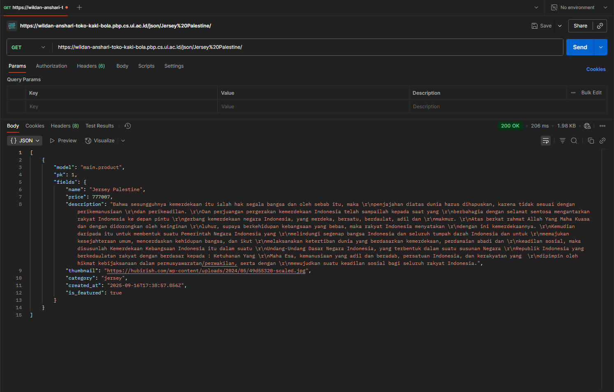
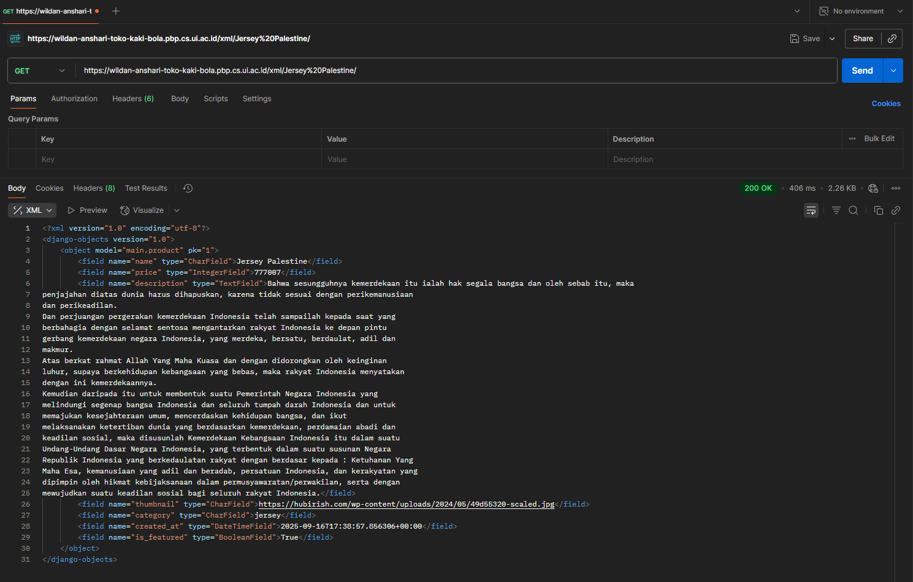
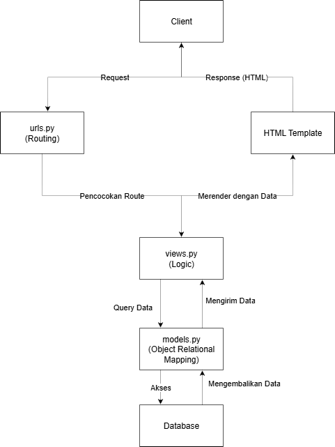

https://wildan-anshari-toko-kaki-bola.pbp.cs.ui.ac.id/

Tugas 4:
1. Adalah form user authentication (Login user) yang disediakan oleh django.
Kelebihan :
- Mudah untuk di setup dan gunakan
- Terintegrasi dengan sistem authentication Django
- Mengikuti standar security Django 

Kekurangan
- Tidak memiliki variasi lain, misalnya ingin login degan email, OAuth, dll.
- Hanya mendukung login dengan username dan password secara default

2. Authentication
- Yaitu proses memverifikasi user
Implementasi dilakukan dengan package django.contrib.auth.*, misalnya AuthenticationForm, authenticate(), login(), dll.

Authorization
- Yaitu proses memverifikasi kewenangan yang dimiliki oleh user setelah authentication
 Implementasi dilakukan dengan permissions dan groups. Groups dapat memiliki permission tertentu sehingga membuat proses pengelompokkan dan otorisasi jadi lebih gampang. 

 3. - Cookies
Kelebihan : Data tersimpan client - side sehingga tidak membebani server
Kekurangan : Memiliki vulnerability, ukuran terbatas sehingga data tidak se-kompleks session dan dapat di modifikasi oleh user

- Session
Kelebihan : Data tersimpan server - side sehingga lebih aman dan dapat menyimpan data lebih kompleks
Kekurangan : Karena disimpan server - side maka akan membebani server dan juga memerlukan session management

4. Memiliki beberapa risiko potensial :
- Bisa dicuri melalui XSS
- Dapat terkena MiTM attack apabila tidak memakai HTTPS
- Cookies dapat di modifikasi oleh client
Penanganan Django :
- Cookie session id di sign secara cryptographic
- Dapat mencegah akses cookie dari JavaAScript apabila HttpOnly = True
- Dapat mencegah MiTM apabila Secure=True
- Menggunakan CSRF untuk mencegah cross site requests

5. - Pertama saya mengimplementasikan beberapa function seperti Registrasi, Login dan Logout
- Saya lalu memodifikasi beberapa views sehingga hanya dapat dilihat apabila sudah login. 
- Setelah itu, saya mengimplementasikan cookies 
- Terakhir saya menghubungkan model produk saya dengan user

Tugas 3:
1. Data delivery di perlukan sebagai proses pengiriman dan penerimaan data antara dua bagiany yang berbeda, yaitu frontend dan backend. Front end adalah tampilan yang dilihat pengguna di browser, sedangkan Backend adalah server yang menyimpan data, logika, dll.

2. JSON karena syntaxnya yang lebih mudah untuk di baca oleh manusia dan juga sangat mudah diproses oleh JavaScript karena formatnya sudah native. 
Alasan JSON lebih populer :
- JSON lebih ringan dan lebih cepat untuk ditransfer melalui jaringan karena proses parsing di sisi browser lebih cepat karena JavaScript dapat memahaminya secara langsung.
- Lebih mudah untuk dibaca karena menggunakan format key-value.
- Sebagian besar API dan framework JavaScript menggunakan JSON untuk pertukaran data.

3. Gerbang validasi utama sebelum mengirim data ke database, validasi yang di lakukan yaitu validasi tipe data, constraints ataupun validasi kustom lainnya. is_valid() diperlukan untuk mencegah data yang tidak sesuai yang diminta ataupun sampai dengan mencegah SQL Injection, XSS, dll.

4. Untuk mencegah dari serangan Cross-Site Request Forgery, jika kita tidak menambahkan csrf-token maka oknum dapat dengan mudah memanfaatkan session cookies untuk login dari situs lain. Karena tidak adanya sebuah verifikasi pencocokkan token, maka oknum dapat login dengan gampang dan melakukan apa saja.

5. Pertama saya buat form baru untuk menerima data apabila ada produk baru yang akan ditambahkan. Selanjutnya saya membuat 4 fungsi baru, 2 diantaranya yaitu untuk menambah produk dan menunjukkan produk yang ada, dan 2 lagi untuk show json dan xml dari produk. Kemudian saya membuat 2 html untuk kedua fungsi menambah produk dan menunjukkan produk yang ada. Lalu saya membuat 2 path baru untuk kedua fungsi tersebut agar di buka di halaman yang berbeda dan menghubungkan dengan html.

Tugas 2:
1. - Pertama, terlebih dulu saya membuat direktori, mengaktifkan virtual environment lalu menginstall semua dependencies.
   - Membuat proyek django baru sesuai dengan nama proyek saya.
   - Mengkonfigurasi proyek django sesuai tutorial.
   - Mengupload proyek saya ke github
   - Membuat aplikasi django baru yaitu "main"
   - Membuat sebuah template html untuk ditampilkan
   - Membuat model baru sesuai yang diminta tugas, lalu melakukan migrasi
   - Mengkonfigurasi views.py agar dapat merender tampilan HTML dengan data dinamis (Nama dan NPM saya).
   - Mengkonfigurasi routing agar URL dipetakan ke aplikasi main yang telah saya buat
   - Push ke PWS

2. 
    

    - Client mengirimkan request ke website (Lewat browser ataupun POSTMAN)
    - urls.py lalu mencocokkan request dan mengarahkan ke fungsi yang sesuai di views.py
    - views.py lalu memproses logika aplikasi yang telah dibuat, lalu memanggil models.py
    - models.py sebagai jembatan ke Database, mengakses Database lalu mengembalikan data ke views
    - views.py lalu merender HTML template dan data dari models.py
    - Template tersebut lalu dikembalikan ke Client sebagai HTTP Request. Apabila di browser di tampilkan dalam bentuk halaman web

3. Adalah file konfigurasi utama, untuk mengkonfigurasi pengaturan penting seperti Database, Aplikasi yang terdapat pada proyek django, Templates, Middleware, dll.

4. Apabila terdapat perubahan pada models.py, Django akan membuat file migrasi yang berisi instruksi SQL, lalu mengeksekusi file migrasi tersebut ke database sehingga perubahan yang dibuat dapat terbentuk.

5. - Dokumentasi Lengkap & Komunitas Besar
    Django memiliki dokumentasi yang lengkap dan komunitasnya pun cukup besar sehingga gampang untuk mempelajarinya
   - Keamanan Tinggi
    Aman dari vulnerability umum seperti SQL Injection, XSS, CSRF
   - Konsep MVC
    Arsitektur terstruktur dengan jelas, sehingga memudahkan pemahaman

6. Tidak ada sih...     